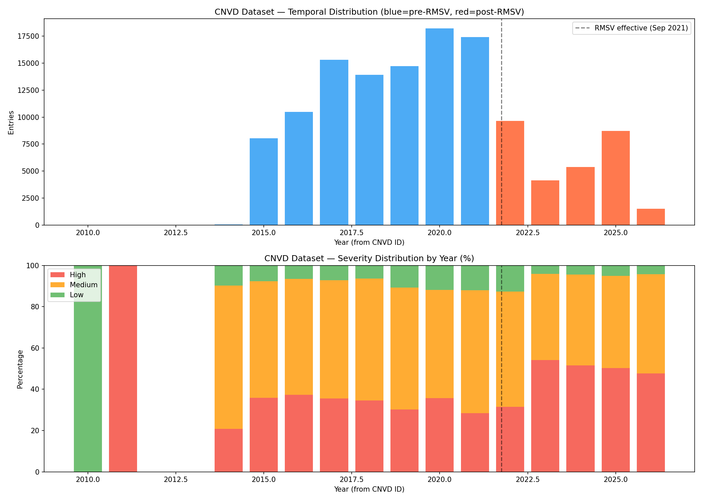
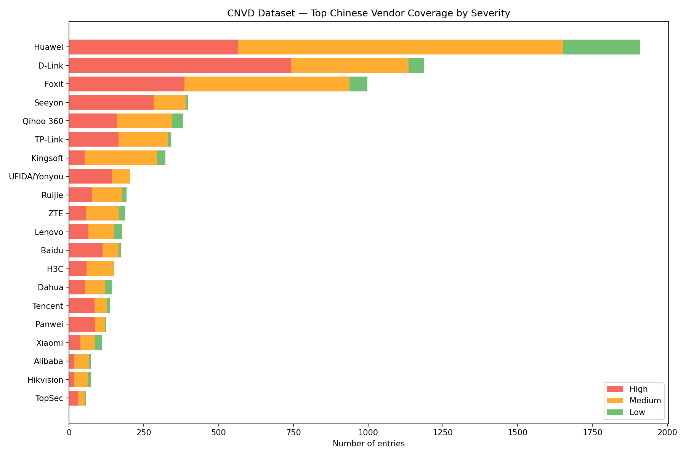

# V1 — NVD Overlap Analysis — Findings Report

**Dataset:** `CIRCL/Vulnerability-CNVD` (Hugging Face)
**Date:** 2026-03-24
**Method:** 1,232-sample stratified reverse lookup via Vulnerability-Lookup API
**Confidence:** 95% CI, ±2.2%

---

## 1. Executive Finding

**80.8% of the CNVD dataset maps to existing CVEs. The dataset is primarily an NVD mirror with Chinese-language descriptions, not a new source of vulnerability intelligence.**

The remaining 19.2% (~24,400 entries) represents genuinely Chinese-domestic vulnerabilities without CVE equivalents, concentrated in 2019–2021. These entries come predominantly from smaller Chinese enterprise software (OA platforms, ERP systems, domestic CMS) rather than major Chinese vendors like Huawei or ZTE.

---

## 2. Dataset Profile

| Field | Value |
|-------|-------|
| Source | `CIRCL/Vulnerability-CNVD` (Hugging Face) |
| Publisher | CIRCL (Computer Incident Response Center Luxembourg) |
| Total entries | 127,562 (train: 114,805 / test: 12,757) |
| Format | Apache Parquet (23.9 MB) |
| Schema | `id`, `title`, `description`, `severity` (4 fields) |
| Language | Simplified Chinese only |
| Severity | Categorical: 高 (High) 36.1% / 中 (Medium) 55.1% / 低 (Low) 8.8% |
| Year range | 2010–2026 (from CNVD ID pattern) |
| CVE cross-references in data | None (0.02% have CVE in text) |
| Associated model | `CIRCL/vulnerability-severity-classification-chinese-macbert-base` |

---

## 3. Overlap Analysis

### 3.1 Methodology

1. Downloaded full dataset from Hugging Face
2. Confirmed no CVE column exists — only CNVD identifiers
3. Text extraction for CVE references yielded 27/127,562 (0.02%) — not viable
4. Performed stratified reverse lookup via `https://vulnerability.circl.lu/api/vulnerability/{CNVD-ID}`
5. Proportionally sampled ~1% per year (1,232 total), 0.5s delay between requests
6. Zero errors, zero rate limits, zero 404s

### 3.2 Results

| Metric | Value | 95% CI |
|--------|-------|--------|
| With CVE mapping | 80.8% (~103,100 entries) | 78.6%–83.0% |
| CNVD-only (no CVE) | 19.2% (~24,400 entries) | 17.0%–21.4% |

### 3.3 CVE mapping rate by year

| Year | Sample | With CVE | Rate | Interpretation |
|------|--------|----------|------|----------------|
| 2015 | 77 | 61 | 79.2% | Baseline period |
| 2016 | 101 | 79 | 78.2% | Baseline period |
| 2017 | 147 | 118 | 80.3% | Baseline period |
| 2018 | 134 | 112 | 83.6% | Baseline period |
| 2019 | 141 | 114 | 80.9% | Baseline period |
| 2020 | 175 | 123 | **70.3%** | Peak CNVD-only |
| 2021 | 167 | 111 | **66.5%** | Peak CNVD-only |
| 2022 | 93 | 91 | **97.8%** | Post-RMSV shift |
| 2023 | 40 | 39 | **97.5%** | Post-RMSV |
| 2024 | 52 | 50 | 96.2% | Post-RMSV |
| 2025 | 84 | 78 | 92.9% | Current |
| 2026 | 14 | 14 | 100.0% | Partial year |

### 3.4 CVE mapping rate by severity

| Severity | CVE mapping rate | 95% CI | n |
|----------|-----------------|--------|---|
| High (高) | 74.4% | ±4.0% | 450 |
| Medium (中) | 84.7% | ±2.7% | 666 |
| Low (低) | 83.6% | ±6.7% | 116 |

Chi-squared test: χ²=18.82, p=8.18e-05 — **severity skew is statistically significant**.

High-severity entries are disproportionately CNVD-only. Chinese-domestic vulnerabilities that never receive CVEs tend to be classified as high severity.

---

## 4. Temporal Analysis

### 4.1 Volume

- **Peak:** 2017–2021 (62% of dataset, 79,565 entries)
- **RMSV cliff (2022):** Volume drops from 17,398 to 9,660 (-44%), coinciding with China's Regulations on the Management of Security Vulnerabilities (effective September 2021)
- **Partial recovery:** 2025 shows 8,714 entries, 2026 has 1,504 (partial year)

### 4.2 Severity shift

- **Pre-2023:** High severity stable at 28–37%
- **Post-2023:** High severity jumps to 48–54%, Low drops from 10–13% to 4–5%
- **Likely explanation:** Change in CNVD submission criteria or dataset curation — not a change in the threat landscape

---

## 5. Vendor Coverage

### 5.1 Dataset composition — Western software dominates

| Vendor/Technology | Entries | % of dataset |
|-------------------|---------|-------------|
| PHP | 16,914 | 13.3% |
| Linux | 8,733 | 6.9% |
| Google | 8,029 | 6.3% |
| Microsoft | 5,927 | 4.7% |
| Adobe | 5,464 | 4.3% |
| Oracle | 4,940 | 3.9% |
| IBM | 4,875 | 3.8% |
| WordPress | 4,549 | 3.6% |
| Cisco | 3,308 | 2.6% |
| Apple | 2,908 | 2.3% |

### 5.2 Chinese vendor representation

| Vendor | Entries | Notes |
|--------|---------|-------|
| Huawei (华为) | 1,908 | Largest Chinese vendor — likely mostly CVE-mapped |
| D-Link | 1,186 | Networking — mostly CVE-mapped |
| Foxit (福昕) | 998 | PDF software |
| Seeyon (致远) | 398 | OA platform — genuinely absent from NVD |
| Qihoo 360 (奇虎) | 382 | Security vendor |
| TP-Link | 341 | Networking — mostly CVE-mapped |
| Kingsoft (金山) | 322 | Office/antivirus |
| UFIDA/Yonyou (用友) | 204 | ERP — genuinely absent from NVD |
| Ruijie (锐捷) | 192 | Networking |
| Baidu (百度) | 175 | Internet services |
| **Total (30 vendors searched)** | **7,567** | **5.9% of dataset** |

### 5.3 Key conclusion

The dataset is **94% Western/open-source software described in Chinese**. Only 5.9% matches Chinese vendor keywords. The ~24,400 CNVD-only entries are predominantly from smaller Chinese domestic software — enterprise OA platforms (Seeyon, Panwei), ERP systems (UFIDA/Yonyou), and domestic CMS/web applications that don't appear in the 30-vendor keyword search.

Major Chinese vendors (Huawei, ZTE, Hikvision) already have CVE coverage and contribute primarily to the 81% overlap.

---

## 6. Verdict

### Assessment against thresholds

| Threshold | Bracket | Match |
|-----------|---------|-------|
| < 10% CNVD-only | NVD mirror | No |
| **10–40% CNVD-only** | **Modest expansion** | **Yes (19.2%)** |
| 40–70% CNVD-only | Significant coverage | No |
| > 70% CNVD-only | Predominantly Chinese | No |

### What the dataset is

1. **A Chinese-language enrichment of known CVEs** — 81% of entries are CVE-mapped, providing Chinese-language titles, descriptions, and categorical severity for vulnerabilities already in NVD
2. **A 3-class severity classification training set** — the MacBERT model classifies severity (High/Medium/Low) for Chinese vulnerability descriptions, not vulnerability types or CWE categories
3. **A modest source of Chinese-domestic vulnerabilities** — ~24,400 entries from Chinese enterprise software (OA, ERP, CMS), operationally relevant only for organisations with Chinese software in their stack

### What the dataset is not

1. **Not a major coverage expansion** — the original claim that it "addresses a structural gap" in Western pipelines is overstated; 81% of the data is already available via NVD
2. **Not a general vulnerability classifier** — the model is a severity classifier (3 classes), not a vulnerability type or CWE classifier
3. **Not a complete CNVD mirror** — the 2022 volume drop and post-RMSV composition change suggest filtering or structural changes in what CNVD makes available

### Impact on original brief

The original threat intelligence brief (2026-03-23 - CNVD Dataset Hugging Face - Brief) has been updated to reflect these findings:
- "Coverage expansion" downgraded from Assessed to Claimed
- 80.8%/19.2% split documented with confidence intervals
- Severity skew finding added (χ²=18.82, p < 0.0001)
- 2022 RMSV discontinuity flagged as open question
- Vendor composition analysis incorporated

---

## 7. Open Questions for Further Validation

| ID | Question | Validation track |
|----|----------|-----------------|
| Q1 | What caused the 2022 volume drop — RMSV filtering, submission changes, or dataset curation? | V4 (provenance) |
| Q2 | What is the MacBERT model's actual precision/recall for severity classification? | V2 (model quality) |
| Q3 | Are there systematic blind spots in the model's severity classification? | V3 (bias detection) |
| Q4 | What software categories dominate the ~24,400 CNVD-only entries? | Requires full enumeration or larger keyword set |

---

## 8. Methodology Notes

- **API endpoint:** `https://vulnerability.circl.lu/api/vulnerability/{CNVD-ID}`
- **Rate limiting:** 0.5s between requests, no rate limits encountered over 1,232 requests (833 seconds total)
- **Sampling:** Proportional stratified by year (~1% per year, minimum 5 per stratum)
- **Statistical tests:** Wilson confidence intervals for proportions, chi-squared test for independence
- **Raw data:** `v1_reverse_lookup_1225.csv` (1,232 records)
- **Charts:** `cnvd_temporal_severity.png`, `cnvd_vendor_coverage.png`
- **Full methodology and code:** [V1 NVD Overlap Analysis](../methodology/V1-NVD-Overlap-Analysis.md)
