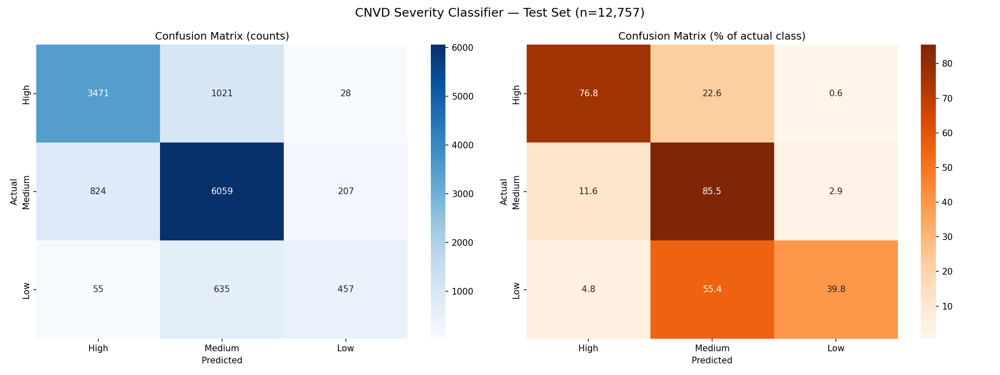
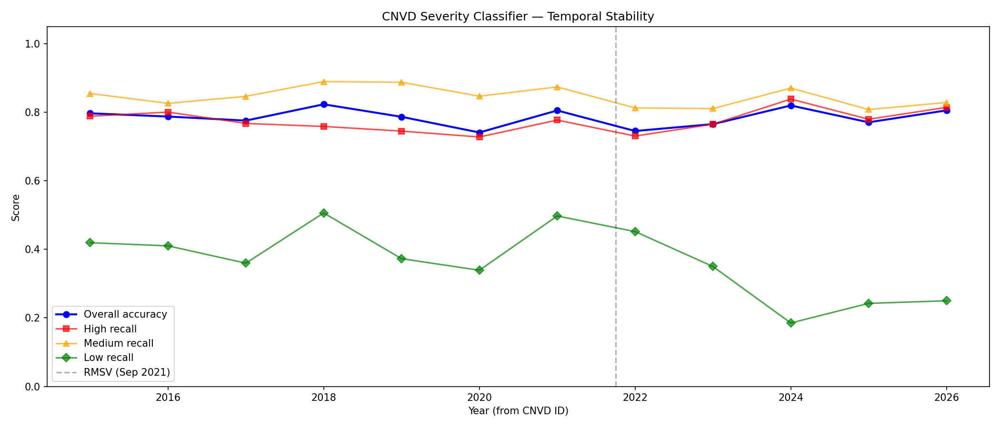
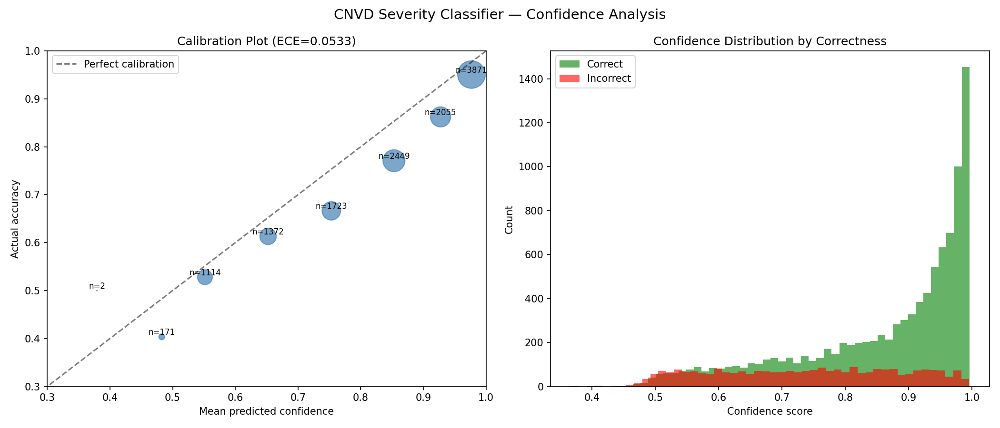
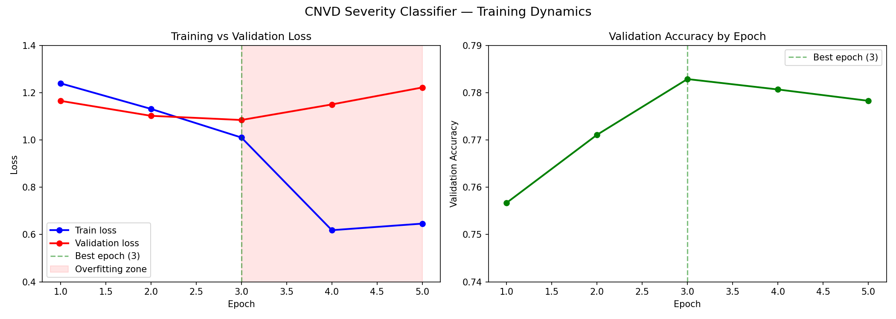

# V2 — Model Quality Evaluation — Findings Report

**Model:** `CIRCL/vulnerability-severity-classification-chinese-macbert-base`
**Date:** 2026-03-24
**Test set:** 12,757 entries (held-out split from `CIRCL/Vulnerability-CNVD`)
**Hardware:** Apple Silicon (MPS), 156 predictions/sec

---

## 1. Executive Finding

**The model's 77.83% accuracy is reproducible (78.29% measured) and beats the majority baseline by +22.7pp. However, it is effectively a two-class classifier: High vs Medium. Low severity classification is broken (39.8% recall — 60% of Low entries are misclassified). The model is mildly overconfident but confidence scores are directionally useful. Post-2024, Low recall collapses further to 18–25%.**

---

## 2. Accuracy Reproduction

| Metric | CIRCL reported | Reproduced | Delta |
|--------|---------------|------------|-------|
| Overall accuracy | 77.83% | 78.29% | +0.46pp |

Reproduced within the ±0.5% threshold — **confirmed**.

---

## 3. Per-Class Performance

### 3.1 Classification report

| Class | Precision | Recall | F1 | Support | Assessment |
|-------|-----------|--------|-----|---------|------------|
| High (高) | 0.798 | 0.768 | 0.783 | 4,520 | Decent — misses 23% |
| Medium (中) | 0.785 | 0.855 | 0.819 | 7,090 | Best — benefits from majority |
| Low (低) | 0.660 | **0.398** | **0.497** | 1,147 | **Broken — misses 60%** |

### 3.2 Confusion matrix

| Actual \ Predicted | High | Medium | Low |
|--------------------|------|--------|-----|
| **High** | **3,471** (76.8%) | 1,021 (22.6%) | 28 (0.6%) |
| **Medium** | 824 (11.6%) | **6,059** (85.5%) | 207 (2.9%) |
| **Low** | 55 (4.8%) | 635 (55.4%) | **457** (39.8%) |

### 3.3 Key failure modes

1. **Low → Medium confusion (55.4%):** The dominant error. Over half of Low entries are predicted as Medium. The model has learned a strong Medium bias.
2. **High → Medium confusion (22.6%):** One in five High entries is downgraded to Medium. For triage purposes, this means 23% of high-severity vulnerabilities are missed.
3. **Cross-extreme errors are rare:** Only 0.6% of High is predicted as Low, and 4.8% of Low as High. The model doesn't make catastrophic errors — it confuses adjacent classes.

---

## 4. Baseline Comparison

| Baseline | Accuracy | Delta vs model |
|----------|----------|----------------|
| Majority class (always Medium) | 55.58% | — |
| **Fine-tuned model** | **78.29%** | **+22.71pp** |

The model adds substantial value over naive prediction. The +22.7pp improvement is well above the "useful" threshold (>15pp).

> [!NOTE] Zero-shot baseline skipped
> Step 3b (zero-shot on MacBERT base) was deprioritised — the majority baseline comparison already demonstrates the fine-tuning adds meaningful value. A keyword heuristic baseline would be the more informative comparison for future work.

---

## 5. Temporal Stability

| Year | n | Accuracy | High recall | Med recall | Low recall |
|------|---|----------|-------------|------------|------------|
| 2015 | 808 | 0.797 | 0.789 | 0.855 | 0.419 |
| 2016 | 1,097 | 0.788 | 0.801 | 0.826 | 0.410 |
| 2017 | 1,561 | 0.776 | 0.768 | 0.847 | 0.360 |
| 2018 | 1,364 | 0.823 | 0.759 | 0.890 | 0.506 |
| 2019 | 1,440 | 0.787 | 0.745 | 0.888 | 0.373 |
| 2020 | 1,858 | **0.741** | 0.728 | 0.847 | 0.339 |
| 2021 | 1,762 | 0.805 | 0.777 | 0.874 | 0.497 |
| 2022 | 919 | 0.745 | 0.731 | 0.813 | 0.452 |
| 2023 | 435 | 0.766 | 0.765 | 0.811 | 0.350 |
| 2024 | 544 | 0.820 | 0.839 | 0.871 | **0.185** |
| 2025 | 816 | 0.771 | 0.780 | 0.808 | **0.242** |
| 2026 | 144 | 0.806 | 0.814 | 0.829 | **0.250** |

### Key observations

- **Overall accuracy spread:** 8.2pp (0.741–0.823) — acceptable but not stable
- **High and Medium recall are stable** across years (~0.73–0.87) — the model generalises well for these classes
- **Low recall collapses post-2024** (drops from ~35–50% to 18–25%) — the severity distribution shift (fewer Low entries post-2023) means the model encounters a distribution it wasn't well-trained for
- **2020 is the worst year** (74.1% accuracy) — coincides with the peak of CNVD-only entries (V1 finding)

---

## 6. Confidence Calibration

| Confidence bin | Count | Accuracy | Mean conf | Gap |
|---------------|-------|----------|-----------|-----|
| 0.0–0.4 | 2 | 0.500 | 0.379 | -0.121 |
| 0.4–0.5 | 171 | 0.404 | 0.483 | +0.079 |
| 0.5–0.6 | 1,114 | 0.528 | 0.551 | +0.024 |
| 0.6–0.7 | 1,372 | 0.613 | 0.652 | +0.039 |
| 0.7–0.8 | 1,723 | 0.666 | 0.753 | +0.087 |
| 0.8–0.9 | 2,449 | 0.771 | 0.853 | +0.082 |
| 0.9–0.95 | 2,055 | 0.862 | 0.927 | +0.065 |
| 0.95–1.0 | 3,871 | 0.951 | 0.977 | +0.026 |

**ECE (Expected Calibration Error): 0.0533** — just above the "good" threshold (0.05), classified as **acceptable**.

### Calibration assessment

- The model is **consistently overconfident** — every bin above 0.5 shows confidence > accuracy (positive gap)
- **Worst overconfidence at 0.7–0.9 range** (7–9pp gap) — the model is most wrong when it's moderately confident
- **Well-calibrated at extremes:** low confidence (0.4–0.6) and very high confidence (0.95+) are both reasonable
- **Confidence is directionally useful:** higher confidence = higher accuracy. A threshold of 0.9 yields 86.2% accuracy on 46% of predictions — usable for filtering high-confidence predictions

### Practical confidence thresholds

| Threshold | Predictions above | Accuracy above | Coverage |
|-----------|-------------------|----------------|----------|
| 0.5 | 11,614 | 79.7% | 91.0% |
| 0.7 | 10,098 | 82.2% | 79.2% |
| 0.8 | 8,375 | 85.8% | 65.6% |
| 0.9 | 5,926 | 91.6% | 46.4% |
| 0.95 | 3,871 | 95.1% | 30.3% |

---

## 7. Overfitting Analysis

| Epoch | Train loss | Val loss | Val accuracy |
|-------|-----------|----------|-------------|
| 1 | 1.2400 | 1.1658 | 0.7567 |
| 2 | 1.1318 | 1.1025 | 0.7711 |
| **3** | **1.0106** | **1.0848** | **0.7829** |
| 4 | 0.6185 | 1.1507 | 0.7807 |
| 5 | 0.6463 | 1.2224 | 0.7783 |

- **Best epoch:** 3 (val loss 1.0848, accuracy 78.29%)
- **Published epoch:** 5 (val loss 1.2224, accuracy 77.83%)
- **Overfit penalty:** 0.46pp accuracy, +0.1376 validation loss
- **Assessment:** Mild overfitting. The model would be marginally better at epoch 3. The published model is not severely degraded, but it represents a suboptimal checkpoint.

---

## 8. Verdict

### Assessment against thresholds

| Metric | Value | Threshold | Rating |
|--------|-------|-----------|--------|
| Accuracy vs CIRCL-reported | +0.46pp | ±0.5% | Good |
| High recall | 0.768 | >0.65 | Acceptable |
| Low recall | 0.398 | >0.65 | **Poor** |
| Fine-tuning delta vs baseline | +22.7pp | >15pp | Good |
| Temporal stability (spread) | 8.2pp | <10pp | Acceptable |
| Calibration (ECE) | 0.053 | <0.05 | Acceptable |

### What the model is

1. **An effective High vs Medium classifier** — 78% accuracy overall, with reasonable High recall (76.8%) and good Medium recall (85.5%). For binary triage ("is this high severity or not?"), the model works.
2. **A confidence-filterable system** — at 0.9 confidence threshold, accuracy reaches 91.6% on 46% of predictions. Vulnerability-Lookup could expose only high-confidence predictions.
3. **Temporally stable for High and Medium** — no degradation across years for the two majority classes.

### What the model is not

1. **Not a reliable three-class classifier** — Low severity recall is 39.8%. The model effectively ignores the Low class and predicts Medium instead.
2. **Not well-calibrated in the mid-range** — confidence scores between 0.7–0.9 are overconfident by 7–9pp. Downstream systems should not trust mid-range confidence without adjustment.
3. **Not optimally trained** — epoch 3 was the best checkpoint; the published epoch 5 is mildly overfit. The impact is small but indicates room for training improvement.

### Practical recommendation

For operational use in Vulnerability-Lookup:
- **Use the model as a binary High-vs-not classifier** rather than a three-class system
- **Apply a confidence threshold of 0.9** for automated decisions — yields 91.6% accuracy
- **Flag Low predictions for human review** — the model's Low predictions have 66% precision but only 40% recall; many true Low entries are silently misclassified as Medium
- **Retrain periodically** — Low recall is degrading on post-2024 data (18–25%)

---

## 9. Open Questions

| ID | Question | Follow-up |
|----|----------|-----------|
| Q1 | Would an epoch 3 checkpoint perform better on Low recall? | V6 (reproducibility) |
| Q2 | Does class-weighted loss or oversampling fix the Low recall problem? | Retraining experiment |
| Q3 | Is a keyword heuristic competitive for severity classification? | Alternative baseline |
| Q4 | How does the model perform on CNVD-only entries vs CVE-mapped entries? | Cross-reference with V1 data |

---

## 10. Methodology Notes

- **Inference device:** MPS (Apple Silicon), 156 predictions/sec, batch size 64
- **Label mapping:** Model outputs English (`High`/`Medium`/`Low`), dataset uses Chinese (高/中/低)
- **Test set:** 12,757 entries (held-out split, same as CIRCL evaluation)
- **Raw data:** `v2_test_predictions.csv` (12,757 records with predictions and confidence)
- **Charts:** `v2_confusion_matrix.png`, `v2_temporal_stability.png`, `v2_calibration.png`, `v2_overfitting.png`
- **Full methodology and code:** [V2 Model Quality Evaluation](../methodology/V2-Model-Quality-Evaluation.md)
