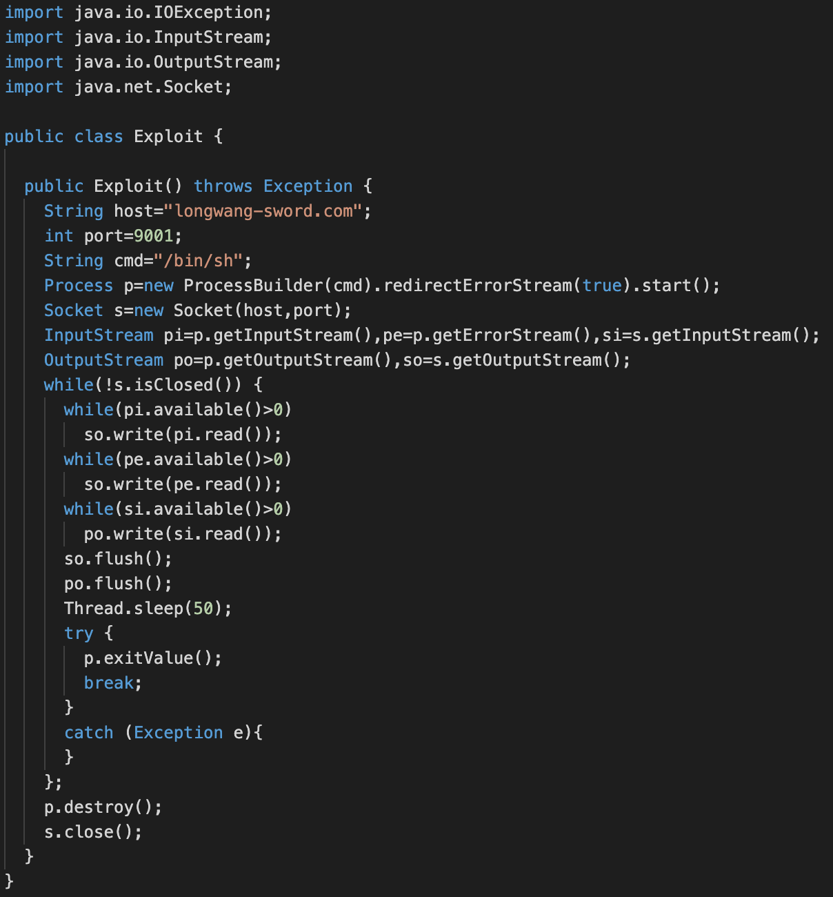

# longwang-sword[.com log4j JNDI LDAP

longwang-sword[.com #log4j #JNDI #LDAP case start with a typical exploitation hit attempt. Image 1 1/x 185[.112[.146[.165


LDAP connection return javaCodeBase longwang-sword[.com port 8000/tcp and javaFactory Exploit.


Exploit.class lead to [7c0cacd55626c49d5280b494b1b58089](https://www.virustotal.com/gui/file/02b8436f860454e476c5694d152aaa3d891d77917ff500a64a636f4c7c097bdf)

Corresponding Exploit.java source code is available on longwang-sword[.com port 8000/tcp


Exploit.java [764bff77120ed108c4248c3cd68a2e55](https://www.virustotal.com/gui/file/1eb57c707cda232f769620019f5b389fe3523d38bb1e59eaded916e0073df8e4) source code lead to longwang-sword[.com port 9001/tcp 



Connection to longwang-sword[.com port 9001/tcp return a ```echo randomstring``` and if the random string is copied and paste, the C&C return a nice message.

