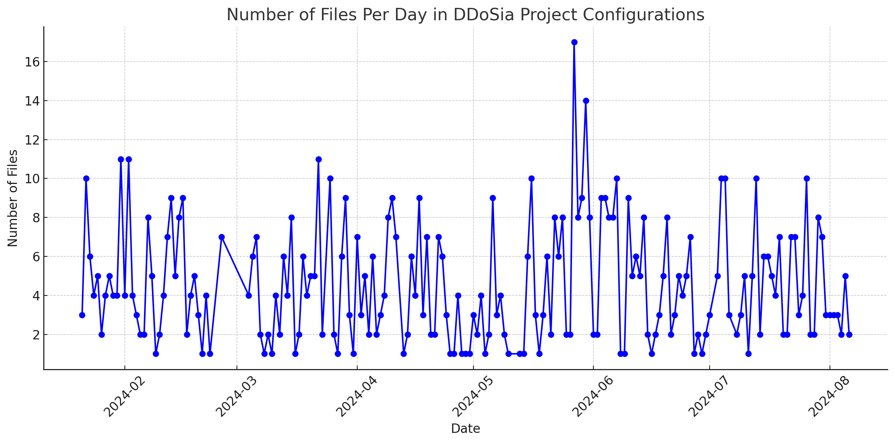
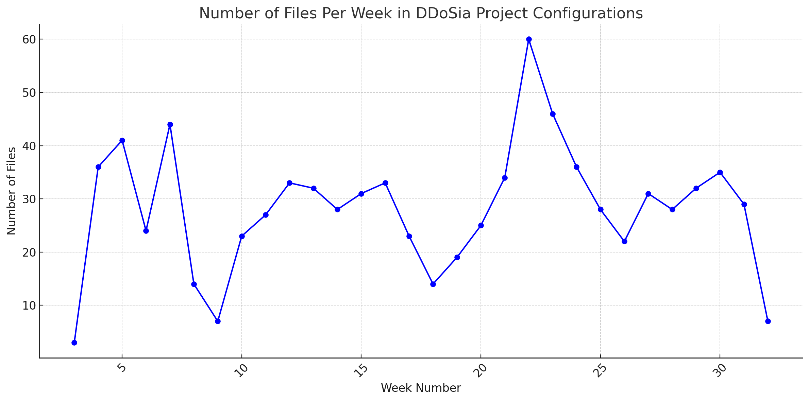
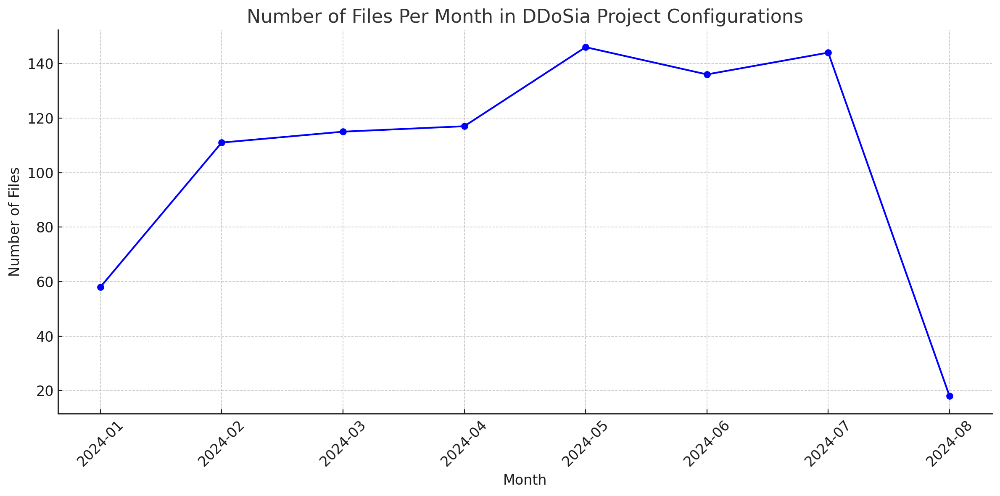

# DDoSia ChatGPT 4o analysis

## Providing context

*What is the DDoSia project ?*

*Use the file name to determine the date. File name have the following format YYYY-MM-DD_HH-MM-SS_DDoSia-target-list.csv where YYYY-MM-DD is the date and HH-MM-SS is the time. The files in the zip file represents configurations of the DDoSia project.*

## Questions & Answers

### General

*What is the first date and timestamp of the configuration files*

January 21, 2024, at 06:05:04

*What is the last date and timestamp ?*

August 6, 2024, at 07:15:03

### Analysis per day

*Provide a table of number of files per day*

[Number of files per day](data/Number_of_Files_Per_Day.csv)

*Plot the number of files per day*

*Show average files per day*

Approximately 4.57 files per day

*Show the busiest day*

The busiest day for the DDoSia project configurations was May 27, 2024, with 17 files.

*Identify the least busy day*

February 9, 2024, with just 1 file.

### Analysis per week

*What is the number of files per week number ?*

[Number of files per week number](data/Number_of_Files_Per_Week.csv)

*Plot number of files per week*

*Show average files per week*

Approximately 28.17 files per week

*Show the busiest week*

Week number 22 of 2024, with 60 files.

*Identify the least busy week*

Week number 3 of 2024, with 3 files

*Analyse the number of files between open business days and week-ends per weeks*

[Number of files between open business days and week-ends](data/Number_of_Files_by_Week_and_Type_of_Day.csv)

### Analysis per month

*What is the number of files per month ?*

[Number of files per month](data/Number_of_Files_Per_Month.csv)

*Plot number of files per month*

### Analysis of non activities

*On the overall period what are the dates and week day name without files*

- Saturday, February 24, 2024
- Sunday, February 25, 2024
- Tuesday, February 27, 2024
- Wednesday, February 28, 2024
- Thursday, February 29, 2024
- Friday, March 1, 2024
- Saturday, March 2, 2024
- Sunday, March 3, 2024
- Sunday, March 24, 2024
- Friday, April 12, 2024
- Saturday, May 11, 2024
- Sunday, May 12, 2024
- Tuesday, July 2, 2024
- Sunday, July 7, 2024

*Are any of these days particular dates in Russia, like public holidays or major events*

None of the dates listed are major public holidays in Russia. Some are adjacent to significant holidays such as Defender of the Fatherland Day and Victory Day, but they are not public holidays themselves.

### Analysis on Saturday's and Sunday's

*On the overall period what are the Saturday's and Sunday's with files. Display a list of with the dates, week day name and number of files*

[List of Saterday's and Sunday's with files](data/Saturdays_and_Sundays_With_Files_and_Counts.csv)

